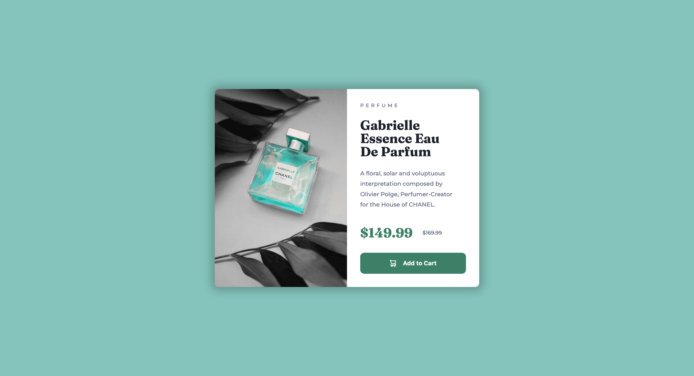
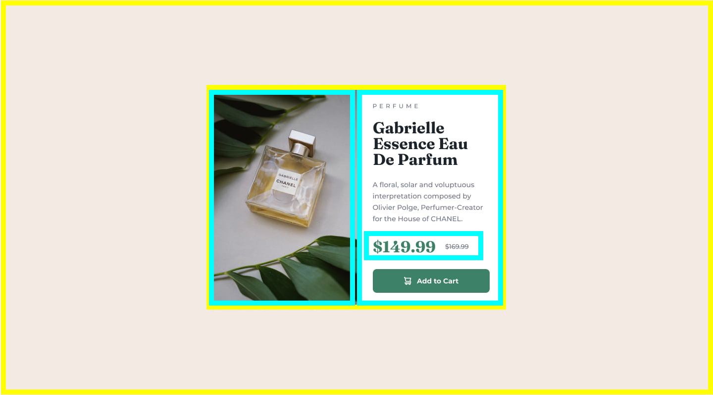

### Links

- Solution URL: [https://www.frontendmentor.io/solutions/product-preview-card-component-css-grid-flexbox-javascript-V9lcetKHdw]
- Live Site URL: [https://user9511.github.io/frontend-mentor-product-preview-card-component/]

# Frontend Mentor - Product preview card component solution

This is a solution to the [Product preview card component challenge on Frontend Mentor](https://www.frontendmentor.io/challenges/product-preview-card-component-GO7UmttRfa). Frontend Mentor challenges help you improve your coding skills by building realistic projects.

## Table of contents

- [Links](#links)
- [Screenshot](#screenshot)
- [My process](#my-process)
- [Built with](#built-with)
- [What I learned](#what-i-learned)
- [Continued development](#continued-development)
- [Useful resources](#useful-resources)
- [Author](#author)

### Screenshot



## My process

I began by opening the original design in Adobe Photoshop. I then broke the design down into seperate components using yellow / blue boxes.

This visual aid makees it easy for me to re-create the desktop / mobile design layout in CSS Grid using grid-template-areas.



### Built with

- Semantic HTML5 markup
- CSS custom properties
- Flexbox
- CSS Grid
- Javacsript

### What I learned

This was my first time using Javascript in one of my project. I wanted to add an animation to the cart-icon when the Add to cart button was clicked.

I researched online and found that this could be achieved by adding an onclick toggle class:

```
const checkoutButton = document.getElementById("btn-id")
const cartLogo = document.getElementById("cart-id")

checkoutButton.onclick = function() {
  cartLogo.classList.toggle('rotate');
}
```

### Continued development

I will continue to work on using CSS Grid to control design layouts across multiple devices. I'm also going to work on incorporating more basic Javascript to add some interactivity into my designs.

### Useful resources

- [A Complete Guide to Grid](https://css-tricks.com/snippets/css/complete-guide-grid/) - This helped me for XYZ reason. I really liked this pattern and will use it going forward.

## Author

- Frontend Mentor - [@Smgy94](https://www.frontendmentor.io/profile/Smgy94)
- LinkedIn - (https://www.linkedin.com/in/shanemcgeown/)
- Twitter - (https://twitter.com/ShaneMcGeown94)
